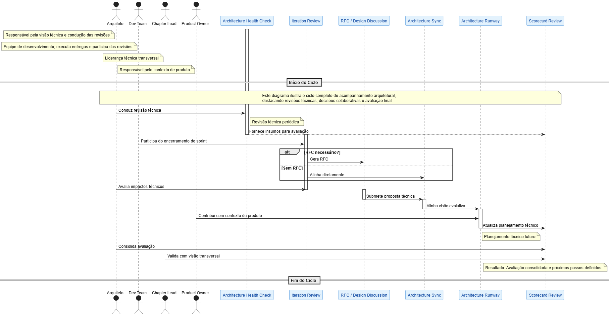
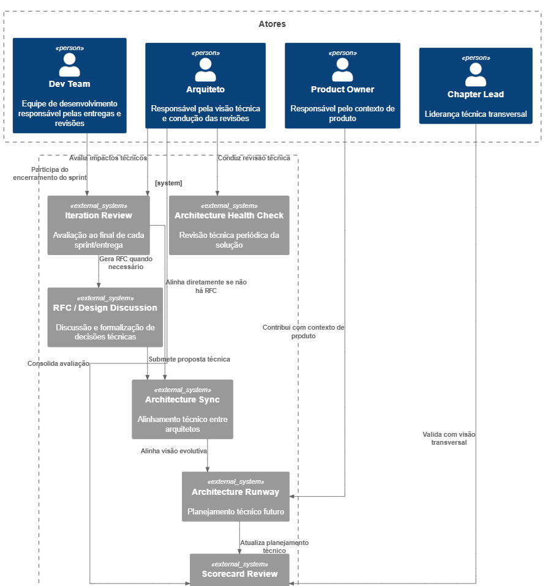
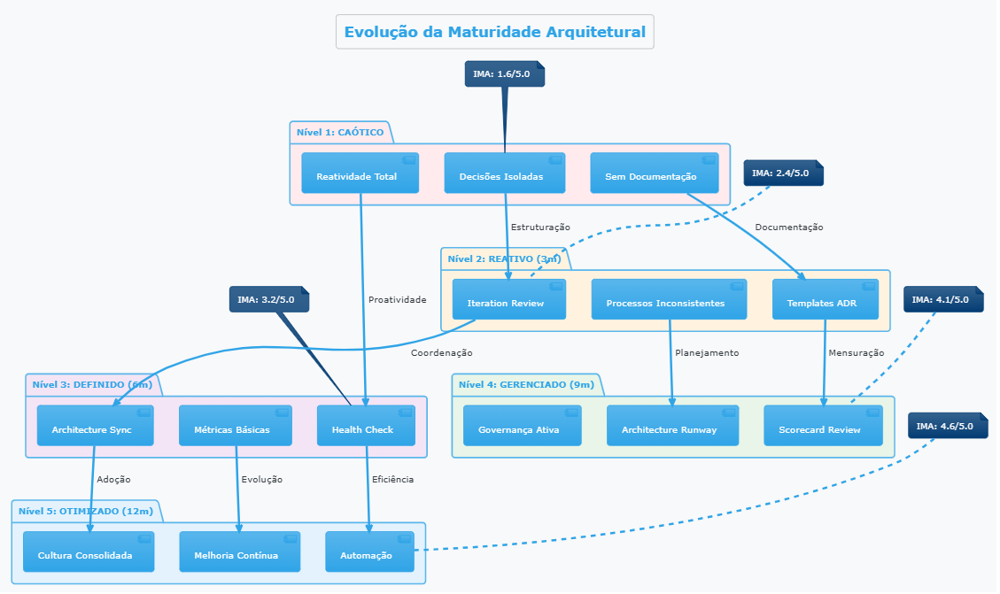

# 📘 Proposta Design Arquitetura - COE Digitalização

## 📌 Título:
**Processo de Acompanhamento Contínuo da Arquitetura de Soluções**

## 📅 Versão:
1.0 – Julho/2025

## 👤 Responsável:
Arquiteto de Soluções – [Paulo Araújo / COE Digitalização]

---

## 💔 Possiveis Dores Arquitetura & Engenharia

A seguir apresentamos um mapeamento das principais **dores e desafios identificados** nos processos de arquitetura e engenharia organizacional. Esta análise foi construída com base em observações práticas, feedbacks de squads e lições aprendidas em diferentes contextos de produto e tecnologia.

**Objetivo**: Identificar problemas recorrentes que justificam a necessidade de processos estruturados de acompanhamento arquitetural, permitindo uma abordagem **proativa ao invés de reativa** na gestão da saúde técnica.

**Legenda da coluna "Concretizado"**:
- ✅ **Confirmado** - Dor observada e validada na prática
- ⚠️ **Parcial** - Ocorre esporadicamente ou em contextos específicos  
- ❌ **Não identificado** - Ainda não observado ou não se aplica ao contexto atual

| Dor Identificada | Descrição do Problema | Impacto | Concretizado |
|------------------|----------------------|---------|:---:|
| **Decisões Arquiteturais Isoladas** | Squads tomam decisões técnicas sem alinhamento, causando inconsistências e retrabalho futuro. | Alto - Fragmentação técnica e dificuldade de integração |❌|
| **Ausência de Documentação Técnica** | Decisões arquiteturais não documentadas (ADRs), dificultando entendimento de escolhas técnicas. | Alto - Perda de contexto e conhecimento organizacional |✅|
| **Tech Debt Invisível** | Dívidas técnicas acumuladas sem visibilidade executiva ou priorização estratégica. | Alto - Degradação da qualidade e produtividade |✅|
| **Reatividade em Arquitetura** | Problemas arquiteturais identificados apenas quando se tornam bloqueadores críticos. | Alto - Retrabalho emergencial e impacto na entrega |⚠️|
| **Alocação Posterior de Arquitetos** | Arquitetos alocados apenas em fase de downstream, limitando o tempo de conhecimento funcional. | Alto - Decisões técnicas tardias e custos de correção elevados |✅|
| **Falta de Governança Técnica** | Ausência de padrões corporativos, resultando em soluções heterogêneas e complexas. | Médio - Complexidade operacional e curva de aprendizado |❌|
| **Silos Técnicos Entre Squads** | Squads isoladas duplicando esforços e criando soluções incompatíveis entre si. | Alto - Desperdício de recursos e baixa reutilização |⚠️|
| **NFRs Não Monitorados** | Requisitos não funcionais definidos mas não acompanhados sistematicamente em produção. | Médio - Riscos de performance, segurança e escalabilidade |✅|
| **Desalinhamento Estratégico** | Evolução técnica desconectada dos objetivos de negócio e roadmap corporativo. | Alto - Investimento técnico sem retorno de valor |❌|
| **Falta de Visibilidade Executiva** | Lideranças sem visão clara da saúde técnica e riscos arquiteturais das soluções. | Médio - Decisões mal informadas e investimentos inadequados |❌|

### 📋 Conclusão

Com base no mapeamento das dores apresentadas, fica evidente a necessidade de estabelecer **processos estruturados e sistemáticos** para o acompanhamento da arquitetura organizacional. As dores identificadas demonstram que a ausência de governança técnica adequada resulta em:

- **Custos elevados** de correção e retrabalho
- **Perda de conhecimento** e contexto técnico organizacional  
- **Fragmentação das soluções** e baixa reutilização de componentes
- **Desalinhamento** entre evolução técnica e objetivos estratégicos

**Os processos e práticas detalhados nas seções seguintes foram especificamente desenhados para mitigar os problemas apontados**, oferecendo uma abordagem preventiva, colaborativa e orientada a resultados para a gestão da saúde arquitetural em escala.

---

## 1. 🎯 Objetivo

Estabelecer um processo estruturado e contínuo para acompanhamento da arquitetura de soluções em squads da XP, garantindo que as decisões arquiteturais evoluam de forma alinhada à estratégia corporativa, mantendo qualidade técnica, governança, segurança e performance ao longo do ciclo de vida do produto.

---

## 2. 🧱 Componentes do Ciclo de Acompanhamento

| Etapa                          | Descrição                                                                 | Frequência        | Responsáveis                  |
|-------------------------------|---------------------------------------------------------------------------|-------------------|-------------------------------|
| Architecture Health Check     | Revisão técnica periódica da solução, com foco em NFRs, modularidade etc. | Mensal / Bimestral| Arquiteto + Tech Lead         |
| Iteration Review Arquitetural| Avaliação ao final de cada sprint ou entrega relevante                     | Por Sprint        | Arquiteto + Dev Team          |
| RFC / Design Discussion       | Discussão para mudanças arquiteturais significativas                      | Sob demanda       | Arquiteto + Devs + Stakeholders |
| Architecture Sync             | Alinhamento entre arquitetos da tribo                                     | Quinzenal / Mensal| Arquitetura Corporativa + Chapter Leads |
| Arquitetura Evolutiva (Runway)| Planejamento técnico contínuo das evoluções                               | Trimestral        | Arquiteto + PO + Dev Lead     |
| Architecture Scorecard Review | Avaliação objetiva da saúde técnica e maturidade arquitetural da solução  | Bimestral / Trimestral | Arquiteto + Tech Lead + Chapter + SRE |

---

## 3. 🩺 Architecture Health Check

### 🎯 Objetivo
O **Architecture Health Check** é uma avaliação técnica periódica e estruturada que visa **verificar a saúde da arquitetura de uma solução** em produção ou em desenvolvimento contínuo. Seu foco é identificar riscos técnicos, desvios de padrão, dívidas acumuladas e oportunidades de melhoria arquitetural com base em critérios bem definidos.

Esse processo garante **visibilidade contínua da qualidade técnica**, apoia decisões de priorização e contribui para a sustentabilidade da solução a médio e longo prazo.

---

### 📅 Frequência Sugerida
- Mensal (para sistemas críticos ou de alta cadência de mudanças)  
- Bimestral ou trimestral (para sistemas mais estáveis)

---

### 👥 Participantes Recomendados
- Arquiteto da squad ou da tribo  
- Tech Lead / Staff Engineer  
- Chapter Lead (se aplicável)  
- Representantes de QA, SRE ou segurança  
- PO (opcional, para alinhamento de riscos e prioridades)

---

### 🧱 Categorias Avaliadas

| Categoria         | Descrição |
|------------------|-----------|
| **Governança Técnica**     | Verifica a existência e atualidade de artefatos como ADRs, RFCs, blueprints, ownership técnico e versionamento da documentação. |
| **Modularidade e Coesão**  | Avalia o nível de separação por domínios, reutilização de componentes, e presença de padrões de acoplamento saudável. |
| **Performance e Escalabilidade** | Valida se a solução atende aos NFRs definidos em relação a latência, throughput, volume de dados e escalabilidade horizontal. |
| **Segurança e Privacidade**     | Revisa práticas de autenticação/autorização, gestão de segredos, criptografia, segregação de dados e aderência à LGPD. |
| **Confiabilidade e Resiliência**| Examina estratégias de fallback, retry, circuit breaker, observabilidade e capacidade de recuperação diante de falhas. |
| **Compliance e Regulação**     | Garante que os requisitos regulatórios aplicáveis (Bacen, CVM, LGPD, SOX, etc.) estão sendo respeitados na arquitetura e operação. |
| **Sustentabilidade Técnica**    | Analisa volume de tech debt, cobertura de testes, automação de deploy, facilidade de manutenção e documentação viva. |
| **Custo e Eficiência Operacional** | Avalia o uso racional da infraestrutura (cloud/on-premises), monitoramento de consumo, uso de recursos elásticos e eficiência financeira da solução. |

---

### ✅ Checklist do Architecture Health Check

- [ ] A documentação técnica está atualizada e acessível?
- [ ] Há ADRs recentes cobrindo decisões críticas do último ciclo?
- [ ] A arquitetura segue padrões de modularidade e domínio?
- [ ] Existe rastreabilidade de logs, métricas e alertas?
- [ ] Todos os endpoints sensíveis estão autenticados e autorizados?
- [ ] Existe plano de recuperação diante de falhas e rollback?
- [ ] Os NFRs estão versionados e são monitorados?
- [ ] Há um backlog técnico de débitos, com visibilidade e priorização?
- [ ] O custo de operação está sob controle com métricas de eficiência?

---

### 📂 Saídas Esperadas

- Documento de **diagnóstico técnico resumido**  
- Lista priorizada de **ações corretivas e melhorias estruturais**  
- Atualização de **artefatos técnicos** (ADRs, documentação, blueprints)  
- Registro de **riscos técnicos e arquiteturais** mapeados  
- Atualização do backlog de **tech debt e evolução arquitetural**

---

### 📌 Observação

O Health Check é uma ferramenta preventiva e estratégica — não punitiva. Seu foco é fornecer **visibilidade contínua, suporte à tomada de decisão técnica e alinhamento com a evolução organizacional da arquitetura**.


## 4. 🔄 Iteration Review Arquitetural

### 🎯 Objetivo
A Iteration Review Arquitetural é uma prática leve e recorrente realizada ao final de cada sprint (ou ciclo de entrega relevante) para **avaliar o impacto técnico das entregas**, **alinhar decisões tomadas durante o desenvolvimento** e **identificar ajustes ou riscos arquiteturais emergentes**.

Essa revisão garante que a arquitetura evolua de forma controlada e alinhada com os princípios de modularidade, escalabilidade, governança e estratégia da organização.

---

### 🧱 Itens Avaliados

| Critério                       | Descrição |
|-------------------------------|-----------|
| **Aderência à Arquitetura Alvo (Target)** | Verificação se as entregas do sprint estão em conformidade com o blueprint arquitetural e os ADRs vigentes. |
| **Impacto Arquitetural das Mudanças**   | Análise de alterações significativas no design, integrações, estruturas de dados, segurança ou infraestrutura. |
| **Atualização de Artefatos Técnicos**   | Confirmação de que ADRs, diagramas, documentações e NFRs foram atualizados conforme as decisões tomadas. |
| **Aumento de Complexidade Técnica**     | Identificação de padrões emergentes de acoplamento excessivo, duplicidade de lógica, ou novas dívidas técnicas. |
| **Observabilidade e Testabilidade**     | Avaliação se novos componentes entregues estão monitoráveis e testáveis conforme critérios mínimos de qualidade. |
| **Conformidade com NFRs**               | Checagem se os novos módulos atendem aos requisitos não funcionais já definidos (ex: latência, segurança, logs). |

---

### 👥 Participantes Recomendados
- Arquiteto da squad ou tribo  
- Tech Lead  
- Desenvolvedores envolvidos na entrega  
- QA / DevOps (se aplicável)  
- PO (opcional, para contextos críticos)

---

### 📅 Frequência
- Ao final de cada **sprint** (Scrum) ou a cada **entrega funcional significativa** (Kanban/XP).

---

### 📂 Saídas Esperadas
- Atualização ou criação de **ADRs** com novas decisões técnicas.  
- Registro de **dívidas técnicas** e riscos identificados.  
- Propostas de ações corretivas ou preventivas.  
- Feedback imediato ao time sobre padrões técnicos, qualidade e alinhamento à arquitetura alvo.  
- Atualização de artefatos no repositório técnico (wiki, markdown, Confluence, etc.).

---

### ✅ Checklist da Iteration Review

- [ ] Alguma decisão técnica relevante foi tomada e precisa ser registrada via ADR?
- [ ] Alguma alteração causou desvio da arquitetura planejada?
- [ ] Algum componente novo introduziu complexidade ou acoplamento inesperado?
- [ ] O código entregue está aderente aos NFRs definidos?
- [ ] Observabilidade e logging foram implementados corretamente?
- [ ] Foram mapeadas novas dívidas técnicas ou riscos?
- [ ] A documentação técnica foi atualizada?

---

### 📌 Observação
A Iteration Review Arquitetural **não substitui o architecture health check formal**, mas serve como mecanismo **preventivo, ágil e incremental** para garantir governança contínua da arquitetura.

## 5. 📄 RFC / Design Discussion

### 🎯 Objetivo

A prática de **RFC (Request for Comments)** ou **Design Discussion** serve para documentar e alinhar **mudanças técnicas relevantes** que possam impactar a arquitetura, o domínio, a operação ou a governança de uma solução.

Ela promove a **colaboração entre arquitetos, engenheiros e stakeholders**, assegura que decisões técnicas não fiquem centralizadas ou implícitas, e permite discussão aberta antes de formalizar um ADR (Architecture Decision Record).

---

### 📌 Quando utilizar uma RFC

- Propostas de **novas abordagens arquiteturais** (ex: troca de mensageria, mudança de banco, novo padrão de autenticação).
- Alterações significativas em **contratos de APIs, schemas ou fluxos core**.
- Introdução de novas tecnologias ou frameworks dentro da stack da empresa.
- Impacto em **segurança, compliance, performance ou escalabilidade** da solução.
- Redesign de fluxos já existentes com **mudança de estratégia** (ex: orquestração → coreografia).

---

### 🧾 Estrutura Recomendada da RFC

| Seção               | Descrição |
|---------------------|-----------|
| **Título da Proposta** | Nome claro e objetivo da mudança proposta. |
| **Contexto**            | Justificativa do problema ou necessidade que motivou a proposta. |
| **Proposta Técnica**    | Descrição da solução proposta, incluindo diagramas e implicações. |
| **Alternativas Consideradas** | Outras abordagens avaliadas e motivo da não escolha. |
| **Impactos Técnicos**    | Detalhamento do que muda em termos de arquitetura, dados, segurança e integração. |
| **Pontos de Atenção / Riscos** | Riscos identificados, dependências externas, trade-offs. |
| **Plano de Adoção**      | Como será feita a transição, rollout e/ou experimentação da mudança. |
| **Status e Aprovação**  | Status da RFC (Draft, Review, Approved, Rejected), responsáveis e histórico de comentários. |

---

### 👥 Participantes Recomendados

- Arquiteto da Squad / Tribo  
- Tech Leads  
- Engenheiros de Software envolvidos  
- Chapter Leads (se aplicável)  
- Especialistas de segurança, dados, DevOps ou integração (quando necessário)

---

### 🗂️ Formato e Ferramentas

- Pode ser criada como arquivo `.md` versionado em repositório Git  
- Ou em ferramentas de documentação como Confluence (template RFC)  
- Comentários e aprovações podem ser feitas via PR, comentários inline ou reuniões técnicas

---

### 📅 Frequência

- Conforme necessidade.  
- Idealmente antes de **qualquer mudança de impacto médio ou alto** no ecossistema técnico.

---

### 📂 Saídas Esperadas

- Documento RFC completo com versão, histórico de revisão e autores  
- Validação formal ou informal da proposta (via reunião, sync ou PR)  
- Geração posterior de ADR (caso aprovado)  
- Registro de riscos e planos de mitigação associados  
- Comunicação aos times impactados pela mudança

---

### 📌 Observações

A RFC é uma prática leve, mas poderosa para evitar decisões isoladas e promover alinhamento técnico. Ajuda a reduzir retrabalho, aumentar a transparência e fortalecer a **maturidade técnica da organização**.

Ela pode evoluir naturalmente para um ADR, se a proposta for aprovada e formalizada como parte da arquitetura da solução.

## 6. 🔄 Architecture Sync

### 🎯 Objetivo

O **Architecture Sync** é um encontro periódico entre arquitetos de uma tribo ou organização para promover o **alinhamento técnico transversal**, garantir a **padronização das práticas arquiteturais** e fomentar a **tomada de decisões compartilhadas** sobre soluções, integrações e direcionamentos estratégicos.

Esse fórum é essencial para mitigar riscos de fragmentação tecnológica, prevenir redundâncias, coordenar interdependências entre squads e manter uma **arquitetura coesa e escalável**.

---

### 📅 Frequência Recomendada
- **Mensal** (ideal para tribos com múltiplas squads em evolução ativa)  
- **Quinzenal** (em contextos de integração intensa ou transformação digital acelerada)

---

### 👥 Participantes Recomendados

- Arquiteto de Soluções da tribo  
- Tech Leads ou Chapter Leaders  
- Arquiteto Corporativo (quando necessário)  
- Especialistas convidados (segurança, dados, DevOps, produtos, etc.)

---

### 📌 Pautas Frequentes do Architecture Sync

| Tópico                          | Objetivo |
|--------------------------------|----------|
| **Atualização de decisões (ADRs/RFCs)** | Compartilhar decisões técnicas recentes de squads e seus impactos no ecossistema. |
| **Padrões técnicos e boas práticas**   | Reforçar guidelines de arquitetura, integração, testes, segurança, observabilidade. |
| **Integrações e dependências entre squads** | Discutir contratos de APIs, eventos, fluxos e sincronismos críticos. |
| **Avaliação de propostas de RFCs**     | Alinhar e validar propostas antes da formalização como ADR. |
| **Riscos arquiteturais**              | Antecipar e tratar riscos técnicos mapeados nas squads. |
| **Visão evolutiva (Architecture Runway)** | Atualizar roadmap técnico comum e identificar impedimentos estratégicos. |

---

### 📂 Artefatos Gerados ou Atualizados

- Lista de decisões compartilhadas  
- RFCs validadas em grupo  
- Propostas de padronização  
- Backlog de ações arquiteturais transversais  
- Registro de riscos técnicos e interdependências

---

### ✅ Benefícios do Architecture Sync

- Redução de **desalinhamento técnico entre squads**  
- Reforço da **governança arquitetural distribuída**  
- Compartilhamento de **lições aprendidas e padrões reutilizáveis**  
- Visão unificada do **estado técnico atual e desejado (Target Architecture)**  
- Fortalecimento do papel do arquiteto como **orquestrador estratégico**

---

### 📌 Observações

O Architecture Sync deve ser um espaço leve, objetivo e orientado à tomada de decisão. Deve **evitar reuniões puramente informativas** e manter foco em **discussões técnicas de alto valor**, promovendo **coerência arquitetural em escala**.

## 7. 🛤️ Arquitetura Evolutiva (Architecture Runway)

### 🎯 Objetivo

A **Arquitetura Evolutiva**, também conhecida como **Architecture Runway**, tem como objetivo antecipar as **capacidades técnicas, estruturais e arquiteturais necessárias para suportar a evolução dos produtos e negócios** ao longo do tempo.

Ela serve como uma camada técnica planejada que sustenta a entrega contínua de valor, **sem comprometer qualidade, escalabilidade e governança**, permitindo que as squads avancem com autonomia, mas dentro de um caminho técnico viável e sustentável.

---

### 🔍 Conceito de Runway

- O termo "runway" vem da analogia com **pista de decolagem**:  
  > “Se não há pista suficiente, o avião não decola com segurança.”  
  Da mesma forma, **sem runway técnico, a evolução do produto sofre riscos e retrabalho.**

---

### 📅 Frequência de Revisão
- Trimestral (preferencial) ou por trimestre fiscal/OKR  
- Sempre que houver pivôs estratégicos ou reestruturação técnica relevante

---

### 🧱 Componentes da Architecture Runway

| Componente                      | Descrição |
|--------------------------------|-----------|
| **Capacidades Técnicas Planejadas** | Módulos, serviços, integrações e componentes que ainda não foram desenvolvidos, mas serão necessários nos próximos ciclos. |
| **Investimentos Técnicos Prioritários** | Iniciativas técnicas estruturantes, como refatorações, migração de dados, adoção de novas plataformas, frameworks ou padrões. |
| **Evolução de NFRs** | Projeções de aumento de carga, latência, escalabilidade, segurança ou regulamentação e seus impactos. |
| **Mapeamento de Riscos Arquiteturais** | Identificação de gaps, limitações e dependências técnicas que devem ser tratadas antes de crescer o produto. |
| **Integrações Futuras** | Conectores, eventos, APIs ou sincronizações planejadas com outros domínios ou sistemas. |
| **Governança de Padrões** | Atualizações previstas nos padrões de arquitetura, testes, deployment, observabilidade ou segurança. |

---

### 📂 Artefatos de Suporte

- Mapa de capacidades técnicas por ciclo ou objetivo de negócio  
- Roadmap arquitetural (técnico e visual)  
- Tech Radar interno  
- Documentos de RFCs futuros (em elaboração)  
- Scorecard de aderência à arquitetura alvo

---

### ✅ Benefícios da Arquitetura Evolutiva

- Permite **planejar refatorações antes de serem críticas**  
- Reduz a ocorrência de **tech debt emergente e retrabalho**  
- Promove **alinhamento entre visão de negócio e visão técnica**  
- Cria uma **ponte entre estratégia, squads e arquitetura corporativa**  
- Garante que a squad possa avançar sem "bloqueios invisíveis" de arquitetura

---

### 📝 Sugestões de Perguntas para Planejamento

- Quais mudanças técnicas serão necessárias se o negócio escalar X vezes?  
- Que parte da arquitetura atual vai se tornar gargalo nos próximos 3-6 meses?  
- Há alguma restrição técnica que precisa ser resolvida **antes** de uma nova funcionalidade ser construída?  
- A arquitetura atual suporta o volume, a segurança e os SLAs exigidos pelos próximos releases?

---

### 📌 Observações

A Architecture Runway **não é uma especificação detalhada do futuro**, mas sim um planejamento técnico orientado à realidade. Ela deve ser **evolutiva, incremental e colaborativa**, ajustando-se conforme o produto cresce, novas informações chegam e aprendizados emergem.

## 8. 📊 Architecture Scorecard Review

### 🎯 Objetivo

O **Architecture Scorecard Review** é um rito periódico voltado à **avaliação da saúde técnica e da aderência arquitetural de uma solução ou plataforma** com base em critérios objetivos, indicadores e métricas predefinidas.

Esse rito promove **visibilidade executiva e técnica**, apoia a **gestão proativa de riscos arquiteturais** e contribui para decisões baseadas em dados, não apenas em percepções.

---

### 📅 Frequência Recomendada

- Bimestral (para squads em evolução constante)  
- Trimestral (para soluções mais estáveis ou maduras)

---

### 👥 Participantes Recomendados

- Arquiteto da Squad ou Tribo  
- Tech Lead  
- Chapter Lead ou Arquiteto Corporativo  
- DevOps/SRE ou representante de operações  
- PO / Gestor técnico (para visibilidade executiva)

---

### 🧾 Itens Avaliados no Scorecard

| Categoria                   | Indicador / Critério                         | Exemplo de Métrica |
|----------------------------|----------------------------------------------|--------------------|
| **Governança Técnica**     | Presença de ADRs, RFCs, documentação atualizada | % de ADRs publicados nos últimos 90 dias |
| **Modularidade e Coesão**  | Acoplamento entre serviços, organização por domínio | Quantidade média de dependências por módulo |
| **NFR Compliance**         | Aderência a requisitos de performance, segurança, escalabilidade | % de NFRs cumpridos por ambiente |
| **Tech Debt**              | Volume e impacto dos débitos técnicos registrados | Nº de itens no Tech Debt Register + tag “Alta Prioridade” |
| **Testabilidade**          | Cobertura de testes, automação, ambiente de QA | % de cobertura de testes automatizados |
| **Observabilidade**        | Logging estruturado, métricas e alertas | % de endpoints monitorados com alertas ativos |
| **Segurança**              | Controles RBAC, criptografia, gestão de segredos | Quantidade de vulnerabilidades abertas / dias médios sem correção |
| **Custos Técnicos**        | Uso de recursos cloud, desperdícios, escalabilidade | Custo mensal por workload ou por requisição |
| **Evolução Planejada (Runway)** | Existência e execução de plano técnico futuro | % de execução das ações de Architecture Runway |

---

### 📂 Artefatos de Entrada

- Architecture Scorecard (planilha ou dashboard com os critérios)  
- Logs de Health Check anteriores  
- Documentação técnica atualizada (ADRs, NFRs, RFCs)  
- Dados operacionais (monitoramento, incidentes, consumo de recursos)

---

### 📤 Saídas Esperadas

- Score consolidado (numérico ou por cor: Verde / Amarelo / Vermelho)  
- Registro de gaps, melhorias e riscos técnicos  
- Propostas de refatoração, evolução ou revisão de arquitetura  
- Atualização do backlog técnico e planejamento do Architecture Runway  
- Comunicação executiva com status técnico da solução

---

### ✅ Benefícios do Architecture Scorecard Review

- Traz **visibilidade clara da saúde técnica** da solução  
- Suporta **decisões técnicas com dados reais**  
- Ajuda a **priorizar evolução técnica com base em valor e risco**  
- Reduz riscos arquiteturais não visíveis no dia a dia da squad  
- Fortalece a cultura de **arquitetura como prática contínua e mensurável**

---

### 📌 Observações

O Scorecard Review não substitui os ritos táticos como Iteration Review ou Health Check, mas fornece uma **visão consolidada e estratégica da evolução técnica da solução**, útil para gestão, priorização e comunicação com lideranças.

---


## 📋 Plano de Ação

**Solução**: Framework estruturado de 6 processos complementares para acompanhamento contínuo da arquitetura.

**Benefícios Esperados**: 
- Redução de retrabalho técnico
- Visibilidade executiva da saúde técnica
- Alinhamento estratégico entre negócio e tecnologia


## 🛣️ Roadmap de Implementação

### Fase 1 (Meses 1-2): Fundação
- [ ] Implementar Iteration Review em 2 squads piloto
- [ ] Criar templates de ADR e RFC
- [ ] Estabelecer Architecture Sync mensal

### Fase 2 (Meses 3-4): Expansão
- [ ] Rollout para todas as squads da tribo
- [ ] Implementar Health Check trimestral
- [ ] Dashboard de métricas arquiteturais

### Fase 3 (Meses 5-6): Maturidade
- [ ] Architecture Runway integrado ao roadmap
- [ ] Scorecard Review automatizado
- [ ] Governança corporativa estabelecida


## ⚠️ Riscos e Planos de Mitigação

| Risco | Probabilidade | Impacto | Mitigação |
|-------|---------------|---------|-----------|
| Sobrecarga dos times | Média | Alto | Processos leves, máximo 30min por ritual |
| Falta de adesão | Alta | Alto | Demonstrar valor através de squads piloto |
| Conflito com agilidade | Baixa | Médio | Integrar aos rituais ágeis existentes |

## 📊 Métricas de Sucesso

### Métricas de Processo
- Taxa de adesão aos rituais (meta: >90%)
- Tempo médio de resolução de tech debt
- Número de ADRs criados por squad/mês

### Métricas de Resultado
- Net Promoter Score técnico das squads
- Redução de incidentes relacionados à arquitetura
- Tempo de onboarding de novos desenvolvedores


## 📚 Glossário de Termos Arquiteturais

| Termo                          | Significado                                                                                          |
|-------------------------------|------------------------------------------------------------------------------------------------------|
| **ADR (Architecture Decision Record)** | Registro formal e versionado de uma decisão arquitetural, incluindo contexto, decisão e impactos. |
| **RFC (Request for Comments)** | Documento colaborativo usado para propor e discutir mudanças técnicas significativas.               |
| **NFR (Non-Functional Requirement)** | Requisitos não funcionais como performance, segurança, disponibilidade, usabilidade, etc.         |
| **Architecture Health Check** | Avaliação periódica da saúde técnica de uma solução com base em critérios arquiteturais definidos.   |
| **Iteration Review Arquitetural** | Rito leve e frequente de avaliação técnica ao fim de cada sprint ou entrega relevante.            |
| **Architecture Sync**         | Reunião de alinhamento técnico entre arquitetos para tratar padrões, integrações e riscos.           |
| **Architecture Runway**       | Planejamento técnico antecipado para suportar evolução do produto e evitar bloqueios arquiteturais. |
| **Tech Debt (Dívida Técnica)**| Código ou arquitetura de baixa qualidade que precisa ser reestruturado futuramente.                 |
| **Blueprint Arquitetural**    | Visão geral estruturada de uma solução, com seus componentes, integrações e direcionamentos.         |
| **Scorecard Arquitetural**    | Conjunto de métricas usadas para medir a saúde técnica e maturidade arquitetural de uma solução.     |
| **Observabilidade**           | Capacidade do sistema de expor o que está acontecendo internamente por meio de logs, métricas e alertas. |
| **Compliance**                | Adesão às normas, regulamentações e requisitos legais (ex: LGPD, Bacen, CVM, SOX).                   |
| **Governança Técnica**        | Conjunto de práticas e controles para garantir qualidade, padronização e rastreabilidade técnica.     |
| **Runway (pista de arquitetura)** | Infraestrutura e decisões técnicas necessárias para suportar a próxima fase de crescimento de um sistema. |
| **Chapter Lead**              | Papel de liderança técnica que atua transversalmente em múltiplos squads dentro de uma tribo.        |
| **Tribo / Squad**             | Estrutura organizacional inspirada no modelo Spotify, com times ágeis focados em domínios específicos. |

### Fluxo de Acompanhamento Arquitetural



Este diagrama apresenta o **fluxo operacional completo dos processos de acompanhamento arquitetural**, detalhando a sequência de atividades, interações entre os participantes e pontos de decisão ao longo do ciclo de governança técnica. O fluxo demonstra como os **seis processos complementares se integram** para formar um sistema coeso de gestão da saúde arquitetural.

A visualização evidencia os **momentos de colaboração entre arquitetos, tech leads, squads e stakeholders**, bem como os artefatos gerados em cada etapa (ADRs, RFCs, scorecards). O diagrama serve como **guia operacional** para implementação prática dos processos e facilita o entendimento das responsabilidades e handoffs entre as diferentes funções técnicas.

**Pontos de destaque**: Sequência lógica dos rituais, interações colaborativas, geração de artefatos de governança e loops de feedback contínuo para melhoria dos processos.

### Fluxo de Acompanhamento Arquitetural C4



Este diagrama utiliza a **notação C4 (Context, Containers, Components, Code)** para representar a arquitetura dos processos de acompanhamento em diferentes níveis de abstração. A abordagem C4 oferece uma **visão hierárquica e estruturada** que facilita a compreensão tanto para audiências técnicas quanto executivas.

O diagrama destaca a **decomposição dos processos em containers e componentes**, evidenciando como cada ritual arquitetural se posiciona dentro do ecossistema organizacional mais amplo. Esta representação é especialmente útil para **comunicação com stakeholders técnicos** que precisam entender a integração dos processos com a infraestrutura, ferramentas e sistemas existentes.

A visualização C4 também facilita a **identificação de dependências tecnológicas**, pontos de integração com ferramentas corporativas (repositórios, wikis, dashboards) e oportunidades de automação dos fluxos de governança arquitetural.

**Benefícios da representação C4**: Clareza hierárquica, facilidade de comunicação técnica, identificação de dependências e suporte ao planejamento de implementação tecnológica.

---

## 🛣️ Timeline de Evolução Arquitetural

### Jornada de Transformação - 12 meses

```
Q1 2025               Q2 2025               Q3 2025               Q4 2025
   |                     |                     |                     |
🚀 PILOTO            📈 EXPANSÃO           🎯 CONSOLIDAÇÃO       ⭐ OTIMIZAÇÃO
   |                     |                     |                     |
   ├─ 2 squads piloto    ├─ Toda a tribo       ├─ Multi-tribos       ├─ Organização completa
   ├─ Iteration Review   ├─ Health Check       ├─ Scorecard Review   ├─ Automação avançada
   ├─ Templates ADR      ├─ RFC estruturado    ├─ Architecture Runway├─ IA para insights
   └─ Architecture Sync  └─ Métricas básicas   └─ Governança ativa   └─ Cultura consolidada
```

### Marcos e Entregas por Fase

#### 🚀 **Fase 1: Piloto (Meses 1-3)**
**Objetivo**: Validar processos e gerar primeiros resultados

| Marco | Entregável | Critério de Sucesso |
|-------|------------|-------------------|
| **M1.1** | Squads piloto selecionadas | 2 squads engajadas e treinadas |
| **M1.2** | Iteration Review implementada | 90% de adesão nas retrospectivas |
| **M1.3** | Templates ADR/RFC criados | 5+ ADRs documentados |
| **M1.4** | Architecture Sync mensal | 3 reuniões realizadas com >80% presença |

#### 📈 **Fase 2: Expansão (Meses 4-6)**
**Objetivo**: Escalar para toda a tribo e estabelecer ritmo

| Marco | Entregável | Critério de Sucesso |
|-------|------------|-------------------|
| **M2.1** | Rollout completo da tribo | 100% das squads participando |
| **M2.2** | Health Check operacional | 2 ciclos completos executados |
| **M2.3** | Dashboard de métricas | Visibilidade técnica em tempo real |
| **M2.4** | RFC process maduro | 10+ RFCs processados e aprovados |

#### 🎯 **Fase 3: Consolidação (Meses 7-9)**
**Objetivo**: Maturar governança e expandir para outras tribos

| Marco | Entregável | Critério de Sucesso |
|-------|------------|-------------------|
| **M3.1** | Scorecard Review ativo | Relatórios executivos mensais |
| **M3.2** | Architecture Runway | Roadmap técnico alinhado ao negócio |
| **M3.3** | Expansão multi-tribos | 3+ tribos adotando os processos |
| **M3.4** | Governança corporativa | Políticas e padrões estabelecidos |

#### ⭐ **Fase 4: Otimização (Meses 10-12)**
**Objetivo**: Automatizar e estabelecer cultura de melhoria contínua

| Marco | Entregável | Critério de Sucesso |
|-------|------------|-------------------|
| **M4.1** | Automação de coleta | 80% das métricas automatizadas |
| **M4.2** | IA para insights | Alertas proativos implementados |
| **M4.3** | Cultura consolidada | NPS técnico >8.0 nas squads |
| **M4.4** | Melhoria contínua | Processos auto-evoluindo |

### Indicadores de Progresso

| Período | Maturidade Geral | Adesão | Documentação | Visibilidade | Alinhamento |
|---------|------------------|--------|--------------|--------------|-------------|
| **Mês 0** | 🔴 Inicial (1.6/5) | 20% | 15% | 25% | 30% |
| **Mês 3** | 🟡 Emergente (2.4/5) | 60% | 45% | 55% | 50% |
| **Mês 6** | 🟡 Estruturado (3.2/5) | 85% | 70% | 75% | 70% |
| **Mês 9** | 🟢 Maduro (4.1/5) | 95% | 85% | 90% | 85% |
| **Mês 12** | 🟢 Otimizado (4.6/5) | 98% | 95% | 95% | 92% |

**Legenda**: 🔴 Crítico | 🟡 Em Desenvolvimento | 🟢 Satisfatório

---

### 🔄 Fluxo de Transformação Arquitetural

O diagrama a seguir apresenta o **fluxo decisório e as etapas sequenciais** da jornada de transformação arquitetural, destacando os pontos de validação e critérios de avanço entre cada fase. Este fluxo garante que a evolução seja **incremental e baseada em resultados mensuráveis**, evitando avanços prematuros que possam comprometer a solidez da implementação.

Cada fase possui **gates de qualidade específicos** que devem ser atendidos antes da progressão para a próxima etapa. O fluxo também contempla **loops de feedback e ajustes** quando os critérios não são totalmente atingidos, assegurando que a maturidade seja genuína e sustentável.

A abordagem em **fases sequenciais com validação** permite que a organização consolide aprendizados, ajuste processos e garanta adesão consistente antes de expandir para novos contextos. Este modelo reduz riscos de implementação e aumenta significativamente as chances de sucesso da transformação arquitetural em larga escala.

**Pontos-chave do fluxo**: Validação por dados, progressão condicionada a critérios objetivos, loops de melhoria contínua e escalabilidade controlada.


### 📈 Fluxo de Evolução da Maturidade Arquitetural

Este diagrama ilustra a **jornada evolutiva da maturidade arquitetural organizacional**, demonstrando como as práticas e capacidades técnicas se desenvolvem de forma orgânica e incremental ao longo do tempo. O fluxo evidencia a **progressão natural desde processos manuais e reativos até um ecossistema técnico maduro e auto-sustentável**.

A evolução apresentada segue uma **lógica de capacitação crescente**, onde cada estágio constrói sobre as bases do anterior, consolidando aprendizados e expandindo o alcance das práticas arquiteturais. O modelo destaca **marcos intermediários mensuráveis** que permitem validar o progresso real versus a percepção de maturidade.

Diferentemente de uma transformação disruptiva, este fluxo enfatiza a **evolução adaptativa e sustentável**, respeitando o ritmo cultural da organização e garantindo que cada avanço seja genuinamente absorvido pelos times. A abordagem gradual reduz resistências e aumenta a probabilidade de consolidação das práticas arquiteturais.

**Elementos-chave**: Progressão orgânica, marcos de validação intermediários, feedback contínuo entre níveis de maturidade, e escalabilidade respeitosa ao contexto organizacional.

